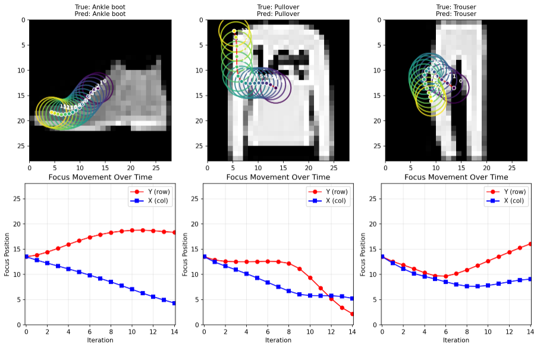

# eye

## Setup

This project uses [uv](https://docs.astral.sh/uv/) for Python package management.

1. Install dependencies:
   ```bash
   uv sync
   ```

2. Run scripts using uv:
   ```bash
   uv run python -m ...
   ```

## Training Fashion-MNIST

To train the neural network on Fashion-MNIST dataset:

```bash
bin/train
```

This will download the dataset, train a simple network, and save the model.

## Results
We can see the model learns to move the eye around, and gets most answers right

